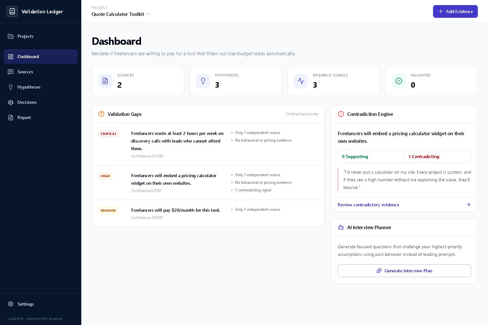
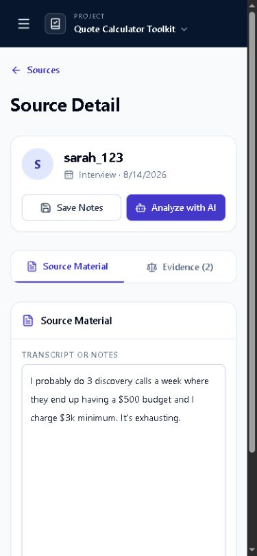

# Validation Ledger

**Turn customer conversations into traceable product decisions—without losing the chain of reasoning.**

**[Try the live demo](https://validation-ledger.vercel.app) · [See how scoring works](#scoring-model) · [Architecture](docs/ARCHITECTURE.md) · [Contribute](CONTRIBUTING.md)**

```text
SOURCE  →  EVIDENCE  →  HYPOTHESIS  →  DECISION (with alternatives, assumptions, and outcomes)
                     ↘ COUNTEREVIDENCE
```


*Animated conceptual tour of the documented evidence model; this is not a fabricated live screen recording.*

Validation Ledger is an MIT-licensed, local-first product-discovery workspace for product managers, UX researchers, and founders who need to preserve the chain from raw customer material to an explicit decision.

### Why it is different

- **Evidence stays traceable.** Quotes and evidence signals remain linked to the source material behind them.
- **Counterevidence stays visible.** Contradictory evidence is scored separately instead of disappearing inside an optimistic summary.
- **The core product is local-first.** Project data lives in IndexedDB in the current browser profile; there is no required application backend.
- **AI is optional, not authoritative.** Gemini extraction only runs when the user explicitly initiates it, and suggested evidence still requires human review.
- **The scoring model is inspectable.** Support strength is derived from explicit factors rather than a hidden model judgment.



> **Feedback wanted:** where does this evidence model create false confidence, miss an important kind of discovery signal, or handle contradiction poorly? If the approach is useful, starring the repository helps other product teams discover it.

**Built by David Turner · [atomicdjt](https://github.com/atomicdjt)**

## Product tour

The workspace includes project and hypothesis management, a source library, source-level evidence extraction, an evidence matrix, decision tracking, reporting, backup controls, and guided demo data.

<p align="center">
  
</p>

## Who it is for

Validation Ledger is designed for people who need to synthesize qualitative customer evidence into defensible product decisions rather than relying on gut feeling, disconnected notes, or opaque AI summaries.

Typical workflows include:

- customer-interview synthesis;
- hypothesis tracking;
- product-discovery evidence review;
- explicit decision records;
- preservation of contradictory signals;
- research handoff and auditability.

## Technology

- React 19, React Router 7, TypeScript 6, and Vite 8
- Tailwind CSS 4 with a custom token-based design system
- Dexie 4 and IndexedDB for browser-local persistence
- Zustand for small persisted interface preferences
- Google Gemini as an optional, user-configured extraction assistant
- Vitest and Oxlint for deterministic tests and static analysis
- Vercel for the static production deployment

## Run locally

Requirements: Node.js 24 and npm 11.

```bash
git clone https://github.com/atomicdjt/validation-ledger.git
cd validation-ledger
npm ci
npm run dev
```

Open the local URL shown by Vite. No environment variable is required for the core product. To use AI extraction, add a restricted Gemini API key in **Settings**; never commit a real key.

## Optional anonymous telemetry

Telemetry is off unless `VITE_POSTHOG_KEY` is configured at build time (and `VITE_POSTHOG_HOST` is optional). It records only these coarse completion events: application load; project, source, hypothesis, manual-evidence, and decision creation; source-note save; and backup export/import. Allowed properties are limited to type, enum, boolean, and link-count metadata.

It never sends source notes, evidence or claim text, user-provided identifiers, URLs, backup content, local database state, API keys, or user identity. Application events use finite structural values only. PostHog still receives the public project token in the transport request and may attach anonymous SDK identifiers and library/timestamp envelope fields required for ingestion; browser, device, URL/referrer, IP-derived location, and session-recording fields are disabled or blacklisted. Missing or failed telemetry configuration cannot affect core product behavior.

To verify ingestion, add the PostHog public project key as `VITE_POSTHOG_KEY` in Vercel, redeploy, complete a single non-sensitive workflow, and inspect PostHog Live Events for an allowlisted event name. Add future events only through `src/services/analytics.ts` with a narrow typed property contract and a corresponding test.

## Quality gate

```bash
npm test
npm run lint
npm run build
npm audit
```

The scoring suite covers source independence, segment diversity, behavioral evidence, direct citations, neutral/missing relationships, counterevidence semantics, and source-text revalidation. GitHub Actions repeats unit tests, lint, production build, dependency audit, Chromium workflow, and automated accessibility checks on every push and pull request.

## Data ownership and backups

The IndexedDB database is named `ValidationLedgerDatabase`. Data is tied to the current browser profile and site origin. Use **Settings → Export backup** regularly; clearing browser storage can remove local records. Backup import validates the supported schema before replacing current data in a single transaction.

The live demo does not receive or retain application data on a server. Optional AI extraction sends the selected text and request directly from the browser to Google's API using the key supplied by the user.

## Scoring model

Validation Ledger reports support and counterevidence separately. Supporting strength combines:

- independent supporting sources, capped at 60 points;
- segment diversity, capped at 15 points;
- behavioral or willingness-to-pay evidence, worth 15 points;
- direct source citations, capped at 10 points.

Counterevidence receives its own independently capped score. Credible support plus contradiction is labeled `mixed`; contradiction without support is `contradicted`. This keeps positive evidence from erasing material counterevidence.

Only excerpts that match the saved source exactly or through conservative whitespace/quotation normalization may be treated as direct evidence. Missing or unverified provenance is displayed as an inference, never as a quote. The score is an aid to judgment, not proof of market demand. AI-generated suggestions also require human review.

## Evidence and boundaries

The technical evidence for the project is documented rather than implied:

- [Architecture and system boundaries](docs/ARCHITECTURE.md)
- [Release checks and current limitations](docs/VALIDATION.md)
- [Security and responsible key handling](SECURITY.md)
- [Contribution workflow](CONTRIBUTING.md)

The scoring system is intentionally heuristic. It structures judgment; it does not prove product-market fit, causal demand, source truthfulness, or research quality.

## More projects

[BuildWorld AI](https://github.com/atomicdjt/buildworld-ai) · [WeaveStudio](https://github.com/atomicdjt/weavestudio) · [GitHub profile](https://github.com/atomicdjt) · [Full portfolio](https://ai-project-portfolio-portfolio-hub.vercel.app/)

## License

Validation Ledger is open source under the [MIT License](LICENSE). Copyright © 2026 atomicdjt.
