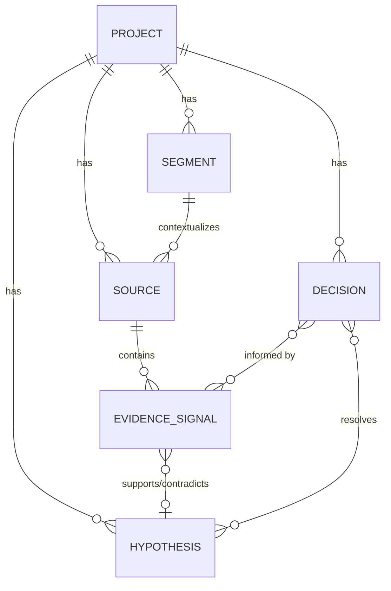

# Architecture Overview

Validation Ledger is a local-first, statically hosted single-page application. It uses IndexedDB via Dexie.js for entirely client-side data persistence, meaning there is no backend server or database to manage, and user data remains private to their browser.

## Technology Stack

- **Framework**: React 19 + TypeScript
- **Build Tool**: Vite
- **Styling**: Tailwind CSS v4 + Tailwind Merge + clsx
- **State Management**: Zustand
- **Routing**: React Router v7
- **Persistence**: Dexie (IndexedDB wrapper)
- **Icons**: Lucide React
- **Date Handling**: date-fns
- **Testing**: Vitest (Unit) + Playwright (E2E)

## Boundaries

- `src/pages` owns route-level views.
- `src/components` owns reusable interface and workflow components.
- `src/db` owns models, migrations, CRUD operations, demo data, and backup validation.
- `src/services/evidenceIntegrity.ts` is the trust boundary between model output and durable evidence: it validates links, verifies excerpts, and creates review-only suggestions.
- `src/services/scoring.ts` owns explainable hypothesis confidence scoring.
- `src/services/ai.ts` owns the optional Gemini integration and validates model output before it reaches the UI.
- `src/store` owns small persisted interface preferences rather than research records.

## Data Flow & State Model

The application strictly separates ephemeral UI state (Zustand) from persistent domain state (Dexie).

### Ephemeral State (Zustand)
Manages the active workspace session.
- `activeProjectId`: Identifies the currently selected project to scope database queries.

### Persistent Domain State (Dexie)
Manages the relational entities defining the decision trace. We use Dexie to handle schema versioning, migrations, and reactive subscriptions (`useLiveQuery`).

## Traceability Design
The core architectural pattern is to heavily leverage foreign keys and explicit many-to-many link tables (`evidenceDecisionLinks`, `hypothesisDecisionLinks`) so that a single `Decision` can trace its lineage back to the raw `EvidenceSignal`, which traces back to the raw `Source` (e.g., an interview).

## Data Integrity and "Provenance"
To ensure evidence isn't silently altered, the `EvidenceSignal` model includes a `provenanceState`. This verifies that the `exactExcerpt` actually matches a substring in the parent `Source.rawText`. If the text deviates, the system degrades the state to `unverified`, surfacing a warning to the user.

## Security & Privacy
Core records are stored exclusively in IndexedDB and there is no application backend or cloud database. The optional Gemini flow can send user-selected text directly from the browser to Google using the user's configured API key, and optional anonymous telemetry sends only the allowlisted structural events described in the README. Users own their local data and can use export/import to back up the database to a standard JSON file.
